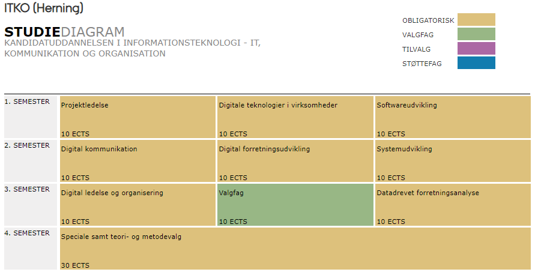

StudieOrdning
+++++++++++++

STUDIEORDNING FOR KANDIDATUDDANNELSEN I INFORMATIONSTEKNOLOGI - IT, KOMMUNIKATION OG ORGANISATION (2022)

+-----------------------+--------------------------------------------------+------------------------------------------------+
| Udgave:               | Udarbejdet af:                                   | Tilknyttet censorkorps:                        |
+=======================+==================================================+================================================+
| 2022                  | Studienævnet for Virksomhedskommunikation og IT  | Censorkorpset for erhvervsøkonomi              |
+-----------------------+--------------------------------------------------+------------------------------------------------+

+-----------------------+--------------------------------------------------+------------------------------------------------+
| Ikrafttrædelsesdato:  | Godkendt af:                                     | Uddannelsen giver ret til betegnelsen:         |
+=======================+==================================================+================================================+
| 01-09-2022            | Dekanen for Aarhus BSS                           | cand.it. i it, kommunikation og organisation   |
+-----------------------+--------------------------------------------------+------------------------------------------------+
	
		
**Normering:		
120 ECTS**		

:: content:

Indhold
Om uddannelsen
Uddannelsens struktur
Generelle regler
Ændringer til studieordningen

1. Om uddannelsen
=================

1.1 Uddannelsens faglige retning og vigtigste fagområder
~~~~~~~~~~~~~~~~~~~~~~~~~~~~~~~~~~~~~~~~~~~~~~~~~~~~~~~~~

Uddannelsens betegnelse er Kandidatuddannelsen i informationsteknologi - it, kommunikation og organisation. Uddannelsen giver ret til titlen cand.it. i it, kommunikation og organisation. På engelsk anvendes titlen Master of Science (MSc) in Information Technology in IT, Communication and Organisation med forkortelsen MScIT.

Uddannelsen kvalificerer de studerende til at løse krævende tekniske, udviklings- og ledelsesmæssige opgaver, der involverer kommunikations- og informationsteknologi i organisationer.

Uddannelsen giver de faglige, fysiske og sociale rammer for, at deltagerne gennem et samspil udvikler faglige færdigheder og personlige kompetencer i udvikling, ledelse og implementering af informationsteknologiske forandringer i virksomheder og organisationer. Dette samspil tilrettelægges ved en stigende grad af integration mellem it, kommunikation og organisation og ved en faglig progression gennem studieforløbet.

Uddannelsen tilrettelægges med udgangspunkt i den enkelte studerendes individuelle faglige forudsætninger fra bacheloruddannelsen, således at kandidatuddannelsens tætte samspil mellem de kollektive og individuelle undervisningsformer tilgodeser udvikling af den enkelte studerendes særlige faglige kompetenceprofil.

Kernefagene i uddannelsen består af: Digitale teknologier i virksomheder, Digital kommunikation, Projektledelse, Softwareudvikling, Systemudvikling, Digital ledelse og organisering, Datadrevet forretningsanalyse samt Digital forretningsudvikling. Disse fag udgør i alt 80 ECTS-points. De studerende skal endvidere vælge et projekt med valgfrit specialiseringsemne til 10 ECTS-points, og uddannelsen afsluttes med et speciale (30 ECTS-points). Der undervises ikke særskilt i metode og videnskabsteori, men der undervises i konkrete metoder og værktøjer, der understøtter den konkrete faglighed, inden for rammerne af de enkelte fag.

Uddannelsen udbydes i Aarhus og Herning.

1.2 Kompetenceprofil
~~~~~~~~~~~~~~~~~~~~~~~~~~~~~~~~~~~~~~~~~~~~~~~~~~~~~~~~~

Kandidatuddannelsen i informationsteknologi – it, kommunikation og organisation giver dimittenderne nedenstående viden, færdigheder og kompetencer.

Viden

Forskningsbaseret og tværfaglig viden om samspillet mellem it, kommunikation og organisation, herunder især udvikling, implementering og drift af digitale teknologier i virksomheder.

Viden om digitaliseringens forretningsmæssige og strategiske konsekvenser for organisationer.
Færdigheder

Kan anvende og integrere teorier og metoder fra forskellige fagområder til at analysere relevante organisatoriske, forretningsmæssige og kommunikative konsekvenser af digitalisering.

Kan formidle forskningsbaseret viden og professionelle og videnskabelige problemstillinger til både fagfæller og ikke-specialister.

Kan analysere organisatoriske samarbejds- og kommunikationsprocesser baseret på relevante videnskabelige metoder, og på baggrund heraf vurdere muligheder og begrænsninger for udvikling gennem anvendelse af digitale løsninger.

Kan, baseret på relevante videnskabelige metoder, analysere og kritisk vurdere muligheder og begrænsninger ved digitaliseringsprocesser i forhold til en organisation og dens interne og eksterne interessenter.
 Kompetencer

Kan udvikle forretningsstrategier der skaber synergi mellem organisationsudvikling, kommunikation og it.

Kan kommunikere digitale forretningsstrategier.

Kan deltage i styring og gennemførsel af digitale udviklings- og forandringsprojekter, der inddrager og kombinerer forskellige organisatoriske ressourcer.

Kan selvstændigt opdatere og videreudvikle faglige kompetencer i den videre karriere.

1.3 Adgangskrav og forudsætninger
~~~~~~~~~~~~~~~~~~~~~~~~~~~~~~~~~~~~~~~~~~~~~~~~~~~~~~~~~

En forudsætning for at kunne søge om optagelse på uddannelsen er, at den studerende har bestået en bacheloruddannelse, hvor mindst 15 ECTS udgøres af fag inden for it, kommunikation og/eller organisation. På https://kandidat.au.dk/informationsteknologi/ er der angivet en lang række bacheloruddannelser, som er adgangsgivende til kandidatuddannelsen. Ansøgere med bacheloruddannelser, der ikke er angivet på listen, vil blive vurderet individuelt i forhold til kravet om 15 ECTS inden for de nævnte fagområder.

Adgangsbegrænsning
Der er adgangsbegrænsning på kandidatuddannelsen i informationsteknologi – it, kommunikation og organisation. Derfor er det at have opfyldt adgangskravene ikke i sig selv en garanti for optagelse.

1.4 Ansøgere med krav på optagelse
~~~~~~~~~~~~~~~~~~~~~~~~~~~~~~~~~~~~~~~~~~~~~~~~~~~~~~~~~

Der er ingen bacheloruddannelser, der giver retskrav til optagelse på kandidatuddannelsen i informationsteknologi.

1.5 Denne uddannelse giver adgang til
~~~~~~~~~~~~~~~~~~~~~~~~~~~~~~~~~~~~~~~~~~~~~~~~~~~~~~~~~

Kandidatuddannelsen giver adgang til ph.d.-uddannelsen efter gældende regler på området.

1.6 Overgangsregler
~~~~~~~~~~~~~~~~~~~~~~~~~~~~~~~~~~~~~~~~~~~~~~~~~~~~~~~~~

Studieordningen er gældende for studerende, der påbegynder uddannelsen i efteråret 2022 eller senere. Studerende indskrevet på tidligere studieordninger færdiggør som udgangspunkt uddannelsen på den studieordning, de er indskrevet på, men kan efter en konkret vurdering overføres til 2022-studieordningen.

1.7 Ramme for uddannelsens færdiggørelse
~~~~~~~~~~~~~~~~~~~~~~~~~~~~~~~~~~~~~~~~~~~~~~~~~~~~~~~~~

Studerende, der påbegynder uddannelsen med studiestart i efteråret 2022 eller senere, skal senest have afsluttet deres uddannelse 1/2 år efter den normerede studietid. Seneste afslutningstidspunkt vil fremgå på studieselvbetjeningen.

Aarhus BSS har yderligere fastsat regler om, at indskrivningen bringes til ophør for studerende, der ikke overholder fakultetets regler vedrørende studieinaktivitet:

Studerende, der inden for 1 år ikke har deltaget i en eksamen, vil blive udmeldt,
Studerende, der inden for 2 år ikke har bestået en eksamen, vil blive udmeldt.

2. Uddannelsens struktur
========================

========================================= ========= ============  ============= =============== ================
Obligatoriske fag                         80 ECTS
========================================= ======================================================================
Projektledelse	                          10 ECTS   1. semester	  7-trinsskala  Prøvedetaljer   Se kursusudbud
Digitale teknologier i virksomheder       10 ECTS   1. semester	  7-trinsskala  Prøvedetaljer   Se kursusudbud
Softwareudvikling                         10 ECTS   1. semester	  7-trinsskala  Prøvedetaljer   Se kursusudbud
Digital kommunikation                     10 ECTS   2. semester	  7-trinsskala  Prøvedetaljer   Se kursusudbud
Digital forretningsudvikling              10 ECTS   2. semester	  7-trinsskala  Prøvedetaljer   Se kursusudbud
Systemudvikling	                          10 ECTS   2. semester	  7-trinsskala  Prøvedetaljer   Se kursusudbud
Digital ledelse og organisering           10 ECTS   3. semester	  7-trinsskala  Prøvedetaljer   Se kursusudbud
Datadrevet forretningsanalyse             10 ECTS   3. semester	  7-trinsskala  Prøvedetaljer   Se kursusudbud
========================================= ========= ============  ============= =============== ================

========================================= ========= ============  ============= =============== ================
Speciale                                  30 ECTS
========================================= ======================================================================
Speciale samt teori- og metodevalg        30 ECTS   4. semester	  7-trinsskala  Prøvedetaljer   Se kursusudbud
========================================= ========= ============  ============= =============== ================

3. Generelle regler
===================

3.1 Hjemmel
~~~~~~~~~~~~~~~~~~~~~~~~~~~~~~~~~~~~~~~~~~~~~~~~~~~~~~~~~

Denne studieordning er udstedt i medfør af:

Uddannelsesbekendtgørelsen, bekendtgørelse nr.  2285 af 1. december 2021 om universitetsuddannelser tilrettelagt på heltid (https://www.retsinformation.dk/eli/lta/2021/2285)

Eksamensbekendtgørelsen, bekendtgørelse nr. 2271 af 1. december 2021 om eksamen og prøver ved universitetsuddannelser (https://www.retsinformation.dk/eli/lta/2021/2271)

Karakterbekendtgørelsen, Bekendtgørelse nr. 1125 af 4. juli 2022 om karakterskala ved uddannelser på Uddannelses- og Forskningsministeriets område (https://www.retsinformation.dk/eli/lta/2022/1125)

Adgangsbekendtgørelsen, bekendtgørelse nr. 35 af 13. januar 2022 om adgang til universitetsuddannelser tilrettelagt på heltid. (https://www.retsinformation.dk/eli/lta/2022/35)

Censorbekendtgørelsen, bekendtgørelse nr. 458 af 19. april 2022 om censorkorps og censorvirksomhed på de videregående uddannelser (https://www.retsinformation.dk/eli/lta/2022/458)

Aarhus Universitets regler på uddannelsesområdet findes i universitetets elektroniske regelsamling Regelsamling (au.dk)

3.2 Regler om studiestartsprøve
~~~~~~~~~~~~~~~~~~~~~~~~~~~~~~~~~~~~~~~~~~~~~~~~~~~~~~~~~

Uddannelsen har ingen studiestartsprøve.

3.3 Merit og fleksibilitet
~~~~~~~~~~~~~~~~~~~~~~~~~~~~~~~~~~~~~~~~~~~~~~~~~~~~~~~~~

Studerende kan søge om forhåndsgodkendelse af studieelementer, som herefter gennemføres ved et andet universitet eller videregående uddannelsesinstitution i Danmark eller i udlandet. En godkendt ansøgning om forhåndsmerit forpligter den studerende til efterfølgende at dokumentere de opnåede resultater – såvel beståede som ikke-beståede, så snart disse resultater foreligger. Studienævnet kan – om nødvendigt – indhente den nødvendige dokumentation direkte. De beståede studieelementer vil herefter blive meriteret ind i den studerendes uddannelse.

Ansøgning om forhåndsmerit og fremsendelse af dokumentation for gennemførte studieelementer med henblik på meritregistrering skal ske i henhold til nærmere fastsatte regler på studieportalen. Herudover kan studienævnet godkende ansøgninger om merit for studieelementer, som er gennemført ved en dansk eller udenlandsk videregående uddannelsesinstitution.

Når studienævnet har godkendt, at et bestået fag eller fagelement fra en dansk eller udenlandsk videregående uddannelsesinstitution meritoverføres, overføres bedømmelsen som »Bestået«. Hvis det pågældende fagelement bedømmes efter 7-trins-skalaen ved begge uddannelsesinstitutioner, overføres bedømmelsen med karakterer, jf. uddannelsesbekendtgørelsen og eksamensbekendtgørelsen.

3.4 Til- og afmelding af prøver
~~~~~~~~~~~~~~~~~~~~~~~~~~~~~~~~~~~~~~~~~~~~~~~~~~~~~~~~~

Tilmelding til fag og prøve sker via studieselvbetjeningen. For tilmeldings- og afmeldingsregler se universitetets regler om placering af, tilmelding til, deltagelse i og afmelding af fag og prøver (http://www.au.dk/om/organisation/regelsamling/5/56/2010-au12/) samt studieportalen for din uddannelse. 

3.5 Stave- og formuleringsevne
~~~~~~~~~~~~~~~~~~~~~~~~~~~~~~~~~~~~~~~~~~~~~~~~~~~~~~~~~

Ved bedømmelsen af kandidatspeciale og andre større skriftlige opgaver vil der ud over det faglige indhold også blive lagt vægt på den studerendes stave- og formuleringsevne.

Ved bedømmelsen af samtlige skriftlige prøver vil der blive lagt vægt på, at den studerende kan formidle en faglig problemstilling og disponere en akademisk opgave herunder opfylde formelle akademiske krav (referencer, citathåndtering, mv.). Ved bedømmelsen af samtlige mundtlige prøver vil der blive lagt vægt på, at den studerende kan præsentere et fagligt stof, strukturere en mundtlig præsentation og indgå i en faglig konstruktiv dialog.

3.6 Regler for større skriftlige afleveringer
~~~~~~~~~~~~~~~~~~~~~~~~~~~~~~~~~~~~~~~~~~~~~~~~~~~~~~~~~

Omfangsbestemmelser af skriftlige afleveringer (kandidatafhandling og/eller større, skriftlige opgaver) vil fremgå af eksamensopgaven. En normalside ved skriftlige afleveringer regnes som 2400 typeenheder (tegn plus mellemrum). Beregningen af normalsider omfatter tekst og noter, men ikke forside, indholdsfortegnelse og litteraturliste.

Vær opmærksom på følgende:

Bilag medregnes ikke i det samlede antal anslag og bruges kun til dokumentation og stikprøver af metode og beregninger anvendt i afhandlingen.
Figurer og illustrationer tæller 800 anslag uafhængig af størrelsen.
Der gælder ikke et minimumskrav til antal anslag. Dette betyder, at din aflevering ikke behøver nå op på det maksimale antal sider.
Der er ingen formelle krav til linjeafstand, margener, skrifttype, sidehoved eller sidefod – så længe din afhandling er læselig og inden for fornuftige rammer.
Hvis andre regler angående antal anslag samt hvilke dele, der tæller med i det samlede antal anslag, undtagelsesvist er gældende, vil dette fremgå af eksamensopgaven.

3.7 Regler for brug af computer ved prøver
~~~~~~~~~~~~~~~~~~~~~~~~~~~~~~~~~~~~~~~~~~~~~~~~~~~~~~~~~

De fleste af de skriftlige eksamener ved AU bliver afviklet i et digitalt eksamenssystem. Der henvises til studieportalen for yderligere information om digital eksamen. Der henvises i øvrigt til Aarhus Universitets gældende regler for tilsynsprøver http://www.au.dk/om/organisation/regelsamling/5/56/56-06-regler-om-tilsynsproever/

3.8 Projektorienterede forløb
~~~~~~~~~~~~~~~~~~~~~~~~~~~~~~~~~~~~~~~~~~~~~~~~~~~~~~~~~

Der er ikke mulighed for projektorientererede forløb på uddannelsen.

3.9 Dispensationer
~~~~~~~~~~~~~~~~~~~~~~~~~~~~~~~~~~~~~~~~~~~~~~~~~~~~~~~~~

En dispensation er en afvigelse fra den eller de regler, der almindeligvis gælder for det pågældende område. Dispensation kan gives på baggrund af ansøgning til den myndighed, der har kompetencen til at give dispensation. Ansøgning om dispensation indgives til studienævnet. Hvis en anden myndighed har kompetencen, videresender studienævnet ansøgningen til rette myndighed (f.eks. dekan, rektor eller ministerium). En dispensationsansøgning skal være skriftlig og begrundet, og skal indgives hurtigst muligt. Hvis ansøgningen umiddelbart skal kunne behandles, skal den indeholde tydelig angivelse af, hvad det er for en regel der søges dispensation fra og hvad der ønskes opnået med dispensationen (f.eks. tilladelse til hjælpemidler, forlænget prøvetid, udsættelse af tidsgrænse). Ansøgningen skal vedlægges dokumentation for de usædvanlige forhold, der begrunder ansøgningen. Udokumenterede forhold kan sædvanligvis ikke tillægges betydning. Der henvises til studieportalen for yderligere information om dispensationer.

3.10 Anke og klage
~~~~~~~~~~~~~~~~~~~~~~~~~~~~~~~~~~~~~~~~~~~~~~~~~~~~~~~~~

Klage over prøver indgives til universitetet. Forudsætningen for at en klage umiddelbart kan behandles er, at den er skriftlig. Det skal fremgå af klagen, hvad der klages over, og hvad der ønskes opnået med klagen. Klager over prøver skal indgives senest 14 dage efter fristen for offentliggørelse af prøvens resultat jf. eksamensbekendtgørelsen.

Der henvises til studieportalen for yderligere information om eksamensklager.

3.11 Om prøver
~~~~~~~~~~~~~~~~~~~~~~~~~~~~~~~~~~~~~~~~~~~~~~~~~~~~~~~~~

Alle prøvers resultater fremgår af eksamensbeviset med deres ECTS-vægt. Der beregnes et gennemsnit med en decimal af alle graduerede bedømmelser. Hver bedømmelse indgår i beregningen med sin ECTS-vægt.

Love og bekendtgørelser samt universitetets regler på uddannelsesområdet kan findes i universitetets elektroniske regelsamling på http://www.au.dk/om/organisation/regelsamling/5/56/

Som led i uddannelsen udarbejdes projektopgaver. Emnet udleveres eller godkendes af den kursusansvarlige underviser. Proceduren for emnevalg og projektarbejdet er nærmere beskrevet i kursusbeskrivelsen.

Projektopgaver udarbejdes i grupper på 4-5 studerende. De nærmere retningslinjer for etablering af grupper fremgår af kursusbeskrivelsen. Er der i forbindelse med en projektopgave en mundtlig eksamination, tager den udgangspunkt i gruppeprojektet, og der gives én individuel karakter. Det vil desuden fremgå af kursusbeskrivelsen, om den mundtlige prøve tilrettelægges som en mundtlig gruppeprøve eller som en mundtlig individuel prøve. Hvis prøven tilrettelægges som en mundtlig gruppeprøve, er det ikke muligt for den studerende at vælge en individuel prøve. Dog gælder der særlige regler for specialet, se kursusbeskrivelse for speciale.

Ved såvel en individuel prøve som en gruppeprøve skal der foretages en individuel bedømmelse af de studerendes præstationer og gives individuelle karakterer.

Eksamenssprog
Der undervises som hovedregel på dansk, men ved enkelte fag kan undervisningen foregå på engelsk. Hvis undervisningen i et fag har været meddelt på engelsk, aflægges prøven ligeledes på engelsk.

3.12 Udveksling
~~~~~~~~~~~~~~~~~~~~~~~~~~~~~~~~~~~~~~~~~~~~~~~~~~~~~~~~~

Det er ikke muligt at tage på udveksling på uddannelsen, da der, sammen med valgfagene til 10 ECTS på 3. semester, ligger obligatoriske fag til i alt 20 ECTS.

4. Ændringer til studieordningen
================================

Juni 2022 Ændring af censurformer:

Digital forretningsudvikling har ændret censurform fra intern til ekstern censur, og Digital ledelse og organisering har ændret censurform fra ekstern til ingen censur.